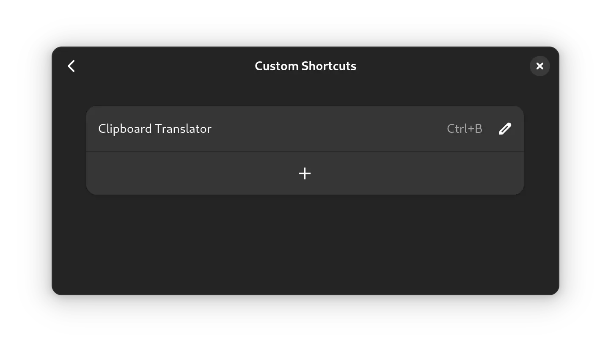
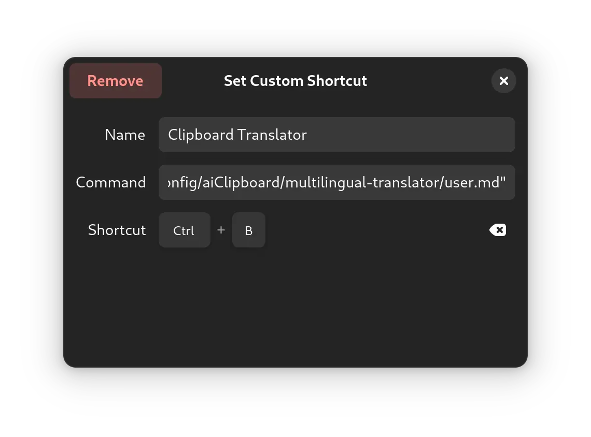

# AI Clipboard

Make your clipboard work with AI.

## Features

This tool is used to obtain clipboard content, process it with AI, and return it.

- Privacy and Secure: This tool does **NOT** listen to the clipboard in the background and only retrieves the first entry from the clipboard when called;
- Custom Model: Supports specifying the model using `--ai-model`;
- Custom Prompts: Supports specifying the prompt with `--system-prompt` and `--user-prompt`;

Welcome to PR your useful prompts :)

## Usage

Here, using GNOME as an example, first download the tool or compile it yourself and place it in the executable directory, which is recommended to be under `/usr/local/bin`. Then create a prompt directory:

```
mkdir ~/.config/aiClipboard
```

You can also use other directories, and now test if it works:

```
aiClipboard --api-key "******" --system-prompt "/path/to/system/prompt" --user-prompt "/path/to/user/prompt"
```

Here I use Multilingual Translator as a test:

```
aiClipboard --api-key "******" --ai-model "gpt-4o" --system-prompt "/home/******/.config/aiClipboard/multilingual-translator/system.md" --user-prompt "/home/******/.config/aiClipboard/multilingual-translator/user.md"
2024/12/13 14:53:38 [2024-12-13 14:53:38] Detected clipboard text: 你好, 世界.
2024/12/13 14:53:40 [2024-12-13 14:53:40] AI response text: Hello, World.
```

After the test, go to *Settings* - *Keyboard* - *Keyboard Shortcuts* - *View and Customize Shortcuts* - *Custom Shortcuts* to set up shortcut keys to invoke the tools:



The command here is exactly the same as during testing, then set the name and shortcut:



Now, you can use the shortcut key you just configured to call the tool.

You can also add more prompts to the prompt directory and configure different shortcut keys for different functions! Let your imagination run wild :)
